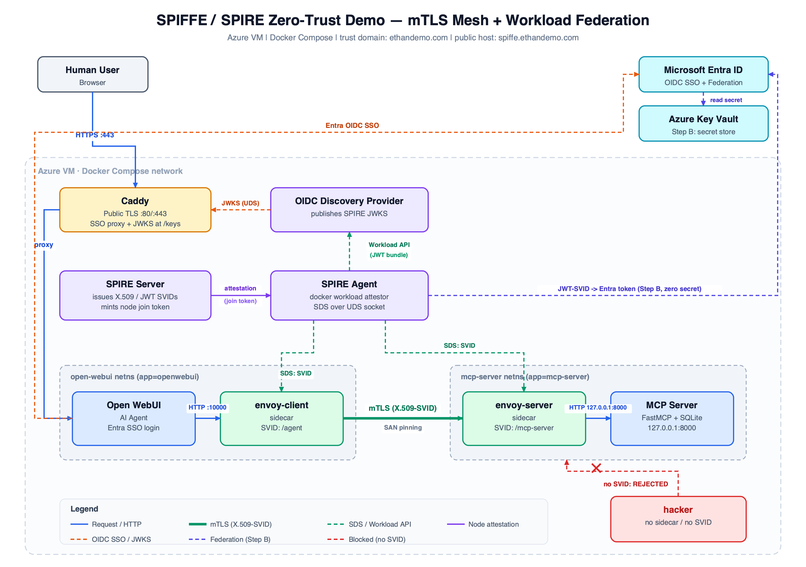

# SPIFFE / SPIRE Zero-Trust Demo

A self-contained Docker Compose lab (see `docs/architecture.png`) showing **workload identity with
SPIFFE/SPIRE**: two Envoy sidecars authenticate to each other over **mTLS** using
short-lived X.509-SVIDs fetched via SDS, an **AI agent (Open WebUI)** calls an
**MCP server (FastMCP + SQLite)** through that secure channel, users log in via
**Microsoft Entra ID**, and an unregistered **hacker container** is rejected.

The Envoy proxies run as **true sidecars** (shared network namespace with their app),
so applications speak plain HTTP to `localhost` and the mesh transparently upgrades it
to mTLS — the deployment shape used in real SPIFFE/Istio meshes.



Plus **workload federation (Step B)**: a workload exchanges its SPIRE **JWT-SVID** for a
Microsoft Entra token with **no client secret** (see below).

Trust domain: **`ethandemo.com`** · Public host: **`spiffe.ethandemo.com`**

---

## Components

| Service | Role |
|---|---|
| `spire-server` | Issues SVIDs; generates the agent join token; registers workload entries |
| `spire-agent` | Node in the trust domain; runs the **docker workload attestor** (label verification) and serves SDS on the shared UDS `/tmp/spire-sockets/api.sock` |
| `oidc-discovery-provider` | Publishes SPIRE JWKS + OIDC discovery doc |
| `caddy` | Public TLS (Let's Encrypt); serves OIDC discovery/JWKS and proxies Open WebUI |
| `open-webui` | AI agent + Entra SSO login (netns owner for `envoy-client`) |
| `envoy-client` | Sidecar in Open WebUI's netns; SVID `spiffe://ethandemo.com/agent` |
| `mcp-server` | FastMCP tool server (SQLite); binds `127.0.0.1:8000` (netns owner for `envoy-server`) |
| `envoy-server` | Sidecar in the MCP netns; SVID `spiffe://ethandemo.com/mcp-server` |
| `federation-demo` | On-demand: exchanges a JWT-SVID (`/agent`) for an Entra token → reads Key Vault (Step B) |
| `federation-impostor` | Same code, identity `/mcp-server` — Entra rejects it (subject mismatch) |
| `hacker` | No sidecar, no SVID — used to demonstrate rejection |

---

## Prerequisites (on the Azure VM)

1. **Docker Engine + Compose v2** installed.
2. **DNS**: `spiffe.ethandemo.com` → the VM's public IP (A record).
3. **Azure NSG / firewall**: allow inbound **80** and **443** (Caddy needs 80 for the
   ACME HTTP challenge and 443 to serve).
4. **Entra App Registration** (for SSO — see below).

## Microsoft Entra ID setup

In the Azure Portal → *Microsoft Entra ID → App registrations → New registration*:

- **Redirect URI** (Web): `https://spiffe.ethandemo.com/oauth/microsoft/callback`
- Copy **Application (client) ID** → `ENTRA_CLIENT_ID`
- Copy **Directory (tenant) ID** → `ENTRA_TENANT_ID`
- *Certificates & secrets → New client secret* → value goes to `ENTRA_CLIENT_SECRET`
- *API permissions*: `openid`, `email`, `profile` (Microsoft Graph, delegated).

> Open WebUI env var names track the pinned image (`ghcr.io/open-webui/open-webui:main`
> uses the native **Microsoft** provider: `MICROSOFT_CLIENT_ID/SECRET/TENANT_ID`).
> If you pin a different tag, verify the OAuth var names in that version's docs.

---

## Run

```bash
cp env.example .env        # then edit .env with your Entra values
docker compose build       # builds the SPIRE + MCP images
docker compose up -d
docker compose logs -f spire-server spire-agent   # watch attestation succeed
```

Then browse to **https://spiffe.ethandemo.com** and sign in with Entra.

### Validate everything

```bash
export PUBLIC_DOMAIN=spiffe.ethandemo.com
bash scripts/demo.sh
```

This prints the SPIRE entries, makes a **legitimate** MCP call through the mTLS path,
shows the **hacker** container being rejected, fetches the public OIDC discovery doc,
and (if `ENTRA_TENANT_ID`/`ENTRA_CLIENT_ID` are exported) runs the federation exchange.

### Wire the MCP tool into Open WebUI

In Open WebUI → *Settings → Tools / MCP servers*, add the streamable-HTTP endpoint:

```
http://localhost:10000/mcp
```

Because `envoy-client` shares Open WebUI's network namespace, the app reaches its
sidecar on `localhost`; the sidecar upgrades the call to mTLS to reach the MCP server.
To enforce the forwarded Entra token on the MCP side, set `REQUIRE_ENTRA_TOKEN=true`
in `.env`.

---

## How it maps to the diagram

| # | Diagram step | Where |
|---|---|---|
| 1 | Web Access / OIDC Login (SSO) | Entra → `open-webui` (`/oauth/microsoft/callback`) |
| 2 | Plain HTTP tool call | `open-webui` → `localhost:10000` (client sidecar) |
| 3 | SDS: Fetch X.509-SVID | Envoy sidecars ← SPIRE agent (shared UDS) |
| 4 | mTLS (authenticate SPIFFE ID) | `envoy-client` ⇄ `envoy-server`, SAN pinning |
| 5 | Plain HTTP forwarding | `envoy-server` → `127.0.0.1:8000` (shared netns) |
| 6 | Node attestation & label verification | `spire-agent` join-token + docker attestor |
| 7 | JWKS fetch (JWT validation) | `oidc-discovery-provider` via Caddy `/keys` |

## Step B: Workload federation (SPIFFE JWT-SVID → Entra → Key Vault, zero-secret)

The payoff of publishing SPIRE's JWKS: a workload authenticates to Microsoft Entra
using **its SPIFFE identity as the credential** — no client secret, no stored key — and
uses the resulting token to read a secret from **Azure Key Vault**.

**Flow** (`scripts/federate.sh`):

1. `spire-agent api fetch jwt -audience api://AzureADTokenExchange` → JWT-SVID
   (`iss=https://spiffe.ethandemo.com`, `sub=spiffe://ethandemo.com/agent`).
2. POST it to Entra as a client assertion (`grant_type=client_credentials`,
   `scope=https://vault.azure.net/.default`) — **no `client_secret`**.
3. Entra validates it against the App's **Federated Credential** (fetching SPIRE's JWKS
   from `https://spiffe.ethandemo.com/keys`) and returns a Key Vault access token.
4. `GET https://<vault>.vault.azure.net/secrets/<name>` with that token → the secret value.

### The demo: mTLS gates *the network*, federation gates *the cloud* — same SPIFFE gate

The essence mirrors the mTLS demo ("registration → access"), but the enforcer is now
Entra and the prize is a cloud secret. Run all scenes with `bash scripts/demo.sh`, or
individually:

| Scene | Actor | SPIFFE ID | Outcome |
|---|---|---|---|
| 1 ✅ | `federation-demo` | `spiffe://ethandemo.com/agent` | Gets Entra token → **reads the Key Vault secret** |
| 2 ❌ | `federation-impostor` | `spiffe://ethandemo.com/mcp-server` | Valid SVID, **wrong subject** → Entra `AADSTS700213` |
| 3 ❌ | `hacker` | *(none)* | No registration → **can't even fetch a JWT-SVID** |
| 4 🔧 | live "break it" | remove `/agent` entry | Scene 1 stops working → re-add → works again |

```bash
docker compose exec federation-demo      /federate.sh   # scene 1: SUCCESS
docker compose exec federation-impostor  /federate.sh   # scene 2: rejected (subject mismatch)
docker compose exec hacker sh -c 'spire-agent api fetch jwt -audience api://AzureADTokenExchange -socketPath /tmp/spire-sockets/api.sock'  # scene 3: no SVID
bash scripts/prove.sh                                    # zero-secret + short-lived proofs
```

**Scene 4 (live break):** deleting the registration entry revokes cloud access exactly
like it revokes MCP access — one gate controls both.

```bash
ID=$(docker compose exec -T spire-server spire-server entry show -spiffeID spiffe://ethandemo.com/agent | awk '/Entry ID/{print $4; exit}')
docker compose exec spire-server spire-server entry delete -entryID "$ID"
docker compose exec federation-demo /federate.sh        # now FAILS (no /agent SVID)
# restore:
docker compose exec spire-server /opt/spire/scripts/register-entries.sh
```
> Note: `/agent` is also the client sidecar's identity, so this visibly breaks the mTLS
> path too — which is the point: registration is the single source of authorization.

### One-time Azure setup

**a) Federated Credential** — App registration → *Certificates & secrets → Federated
credentials → Add → "Other issuer"*:

| Field | Value |
|---|---|
| Issuer | `https://spiffe.ethandemo.com` |
| Subject identifier | `spiffe://ethandemo.com/agent` |
| Audience | `api://AzureADTokenExchange` |

**b) Key Vault** — create a vault, add a secret (`SECRET_NAME`, default `demo-secret`),
and grant the App's service principal the **Key Vault Secrets User** role (RBAC):

```bash
az keyvault create -n <vault> -g <rg> -l <region> --enable-rbac-authorization true
az keyvault secret set --vault-name <vault> -n demo-secret --value 'hello-from-spiffe'
az role assignment create --role "Key Vault Secrets User" \
  --assignee <APP_CLIENT_ID> \
  --scope $(az keyvault show -n <vault> --query id -o tsv)
```

Set `KEY_VAULT_NAME` / `SECRET_NAME` in `.env`.

> Requirements: `https://spiffe.ethandemo.com/keys` must be reachable **from Azure** (it
> is, via Caddy); the Federated Credential subject must exactly equal the SVID's SPIFFE ID.

---

## Security notes & demo shortcuts

- `insecure_bootstrap = true` (agent) and `allow_insecure_scheme = true` (OIDC provider,
  behind Caddy) are **demo conveniences**. In production, bootstrap the agent with the
  server trust bundle and keep the OIDC socket path trusted end-to-end.
- Node attestation uses a **one-time join token** (fine for a single-node VM). The agent
  persists its SVID (`spire-agent-data` volume) so restarts don't need a new token; if you
  wipe that volume, `docker compose restart spire-server` to mint a fresh token.
- `spire-agent` runs with `pid: host` + read-only `docker.sock` so the docker workload
  attestor can map the calling PID to a container's `app=` label.
- **True sidecars**: `envoy-client`/`envoy-server` use `network_mode: service:<app>` to
  share the app's netns. The MCP app binds `127.0.0.1:8000`, so its only network-reachable
  door is the mTLS listener (`mcp-server:9000`). Container labels (hence SPIFFE identity)
  remain per-container — sharing a netns does not change attestation.

## Changing the trust domain

`TRUST_DOMAIN` in `.env` is used by the bootstrap scripts, but the value is also
hard-coded in `spire/server/server.conf`, `spire/agent/agent.conf`,
`spire/oidc-discovery-provider/oidc-discovery-provider.conf`, and both
`envoy/*/envoy-*.yaml` (SDS secret names / SAN matchers). Update all of them together.

## Troubleshooting

- **Envoy has no cert / 503**: check `docker compose logs spire-agent` for successful
  attestation and `docker compose exec spire-server spire-server entry show`. The Envoy
  container's `app=` label must match a registration selector.
- **Caddy TLS fails**: confirm DNS resolves to the VM and ports 80/443 are open in the NSG.
- **Entra login loop**: the redirect URI must exactly equal
  `https://spiffe.ethandemo.com/oauth/microsoft/callback`.
